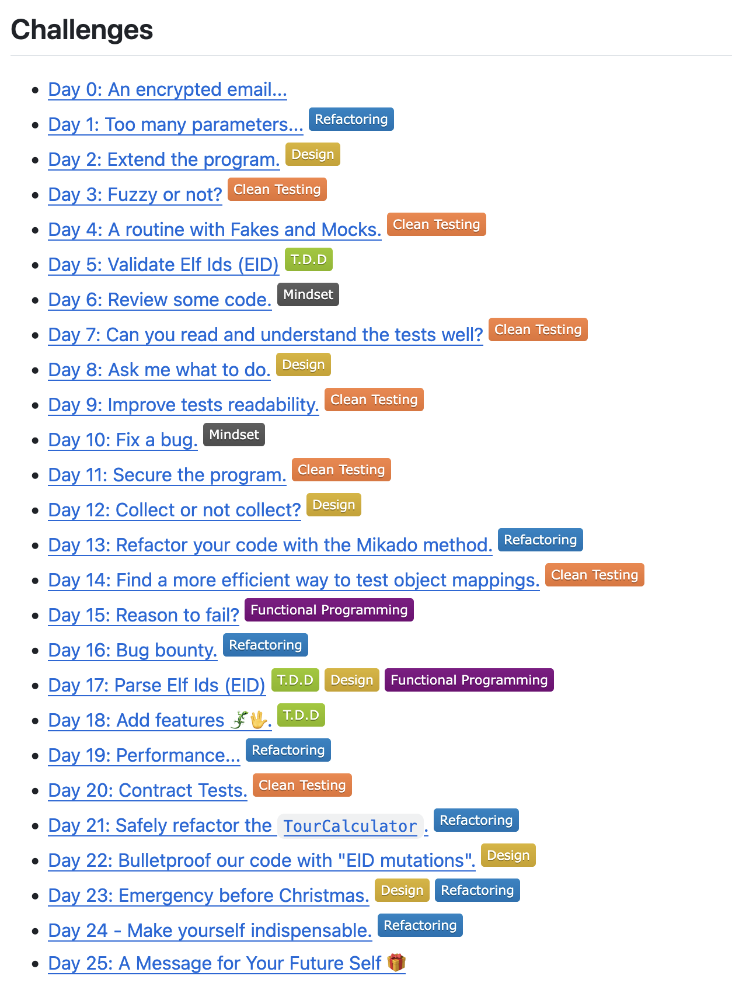

# Advent of Craft 24 - Clean Testing

[Advent Of Craft 2024](https://advent-of-craft.github.io/2024/)
"Craft BETTER Code, TOGETHER, Every Day."

https://github.com/advent-of-craft/2024?tab=readme-ov-file

Challenges, aimed at learning (not as competitive as Advent of Code)
around "Refactoring", "Clean Testing", "Design", "TDD", "Functional", but also "Mindset".

* Day 0
  * Advent of Craft full of valuable challenges
  * We decrypted message using test, failing value used as in "approval testing"

* Day 4
* test doubles
  * https://swkwien.github.io/gdcr23/#/test-double-patterns
    * [Mocks Aren't Stubs](https://martinfowler.com/articles/mocksArentStubs.html)
    * [The Little Mocker (Clean Code Blog)](https://blog.cleancoder.com/uncle-bob/2014/05/14/TheLittleMocker.html)
    * [xUnit Patterns](http://xunitpatterns.com/)
  * jest ist (für mocking) anstrengend, ohne extra plugins (jest-mock-extended)
